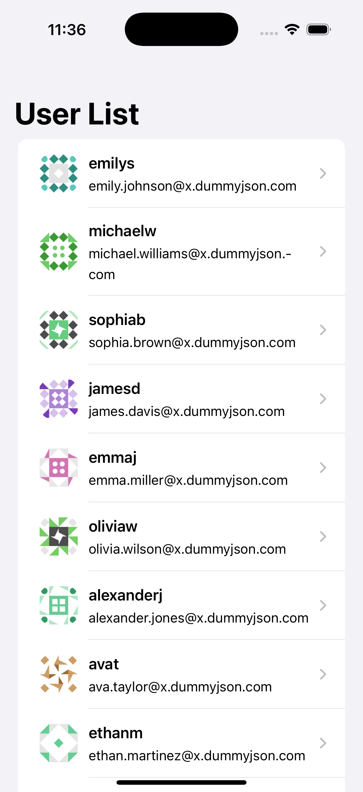
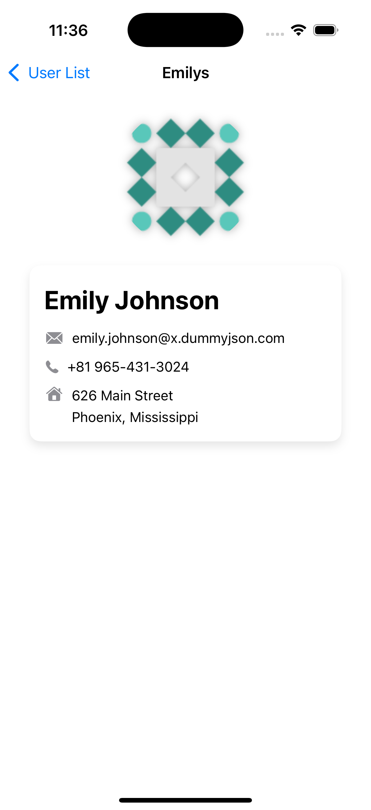
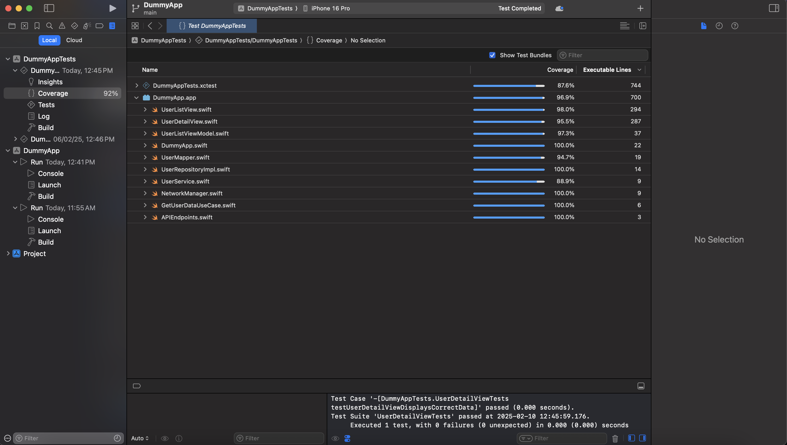

#📱 DummyApp

# Introduction

DummyApp is an iOS application built using SwiftUI and follows CLEAN Architecture with MVVM. The app fetches and displays user data from a mock API, allowing users to view detailed user information.

# Key Features

- ✅ CLEAN Architecture (Presentation, Domain, Data layers).
- ✅ MVVM Design Pattern.
- ✅ Dependency Injection.
- ✅ Unit, UI & Snapshot Testing.
- ✅ Swift Package Manager (SPM) for dependencies.
- ✅ Combine for Async Programming.
- ✅ Mocking & Testability with Custom URL Protocol.

# 🚀 Getting Started
📌 Prerequisites
- Before running the project, ensure you have:
- macOS with the latest Xcode
- Swift 5.5+
- iOS 16+ Simulator (or physical device)
- Swift Package Manager

# 📦 Setup & Run
✅ Clone the Repository

- git clone "https://github.com/bipinthakur002/DummyApp.git"
- cd DummyApp

## 📸 Screenshots

### 📌 User List Screen

### 📌 User Detail Screen

### 🧪 Test Coverage 

